# QoQo Quantum Cryptography Docker

*QoQo Quantum Cryptography Docker* es un entorno de simulación de protocolos criptográficos pre-cuánticos, cuánticos y post-cuánticos, este utiliza *software* *[Docker](https://www.docker.com/)* para consiguir un entorno aislado con todas las librerías necesiarias para la realización de distintas prácticas de la asignatura *Internet cuántica y criptografía cuántica* del *Master Universitario en Tecnologías e Ingeniería Cuánticas* de la *Universidad Carlos 3 de Madrid*.

## Índice
- [Dependencias del Entorno de Simulación QoQo Quantum Cryptography Docker](#dependencias-del-entorno-de-simulación-qoqo-quantum-cryptography-docker)
- [Ejecución Del Entorno de Simulación QoQo Quantum Cryptography Docker](#ejecución-del-entorno-de-simulación-qoqo-quantum-cryptography-docker)
- [Como salir del Entorno de Simulación QoQo Quantum Cryptography Docker](#como-salir-del-entorno-de-simulación-qoqo-quantum-cryptography-docker)
- [Como Reconstruir el Entorno de Simulación QoQo Quantum Cryptography Docker](#como-reconstruir-el-entorno-de-simulación-qoqo-quantum-cryptography-docker)
- [Comandos Utiles de Docker Cli (Command Line Interface)](#comandos-utiles-de-docker-cli-command-line-interface)
- [Posibles Errores en el Sistema Operativo Windows](#posibles-errores-en-el-sistema-operativo-windows)

## Dependencias del Entorno de Simulación QoQo Quantum Cryptography Docker

Para poder ejecutar el entorno de simulación **deberemos tener instaladas las siguiente dependencias**:
1. ***Docker Desktop*** software de código abierto para el despliegue de aplicaciones en contenedores de software aislados del sistema principal de la máquina. Para descargarlo pulsa en el siguiente [enlace](https://www.docker.com/).
2. ***Visual Studio Code*** editor de código fuente desarrollado por *Microsoft*. Para descargarlo pulsa en el siguiente [enlace](https://code.visualstudio.com/).
3. ***Git*** software de control de versiones diseñado por *Linus Torvalds*, este lo utilizaremos para clonar este repositorio en nuestro *PC*, en caso de que no se adjunten los archivos por parte del profesor de la asignatura. Para descargarlo pulsa en el siguiente [enlace](https://git-scm.com/downloads).
4. **Extensión *dev-containers* de *Visual Studio Code*** extensión de *Visual Studio Code* que nos permite ejecutar contenedores *Docker* y sustituir el entorno de ejecución de este editor código por el contendor. Para instarlar esta dependecia deberas seguir los siguientes pasos:

    1. Deberemos iniciar *Visual Studio Code* y **pulsar sobre el icono cuadrado que contiene con 4 cuadrados** donde uno de ellos sale del cuadrado principal, si dejamos el ratón sobre dicho icono nos aparecerá una viñeta marcandonos que es el icono de la pestaña *Extensions*, como se puede observar en la siguiente imagen: 
        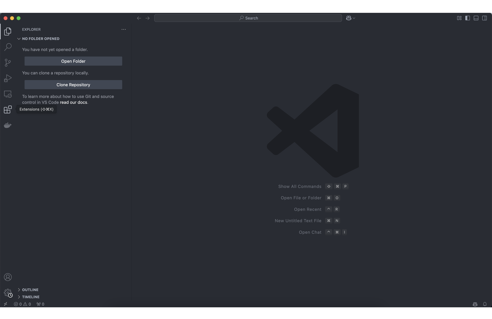

    Tras esto se **abrirá en la parte izquierda de *Visual Studio Code*, al lado de los iconos, una nueva pestaña,** como se puede observar en la siguientes imagen: 
        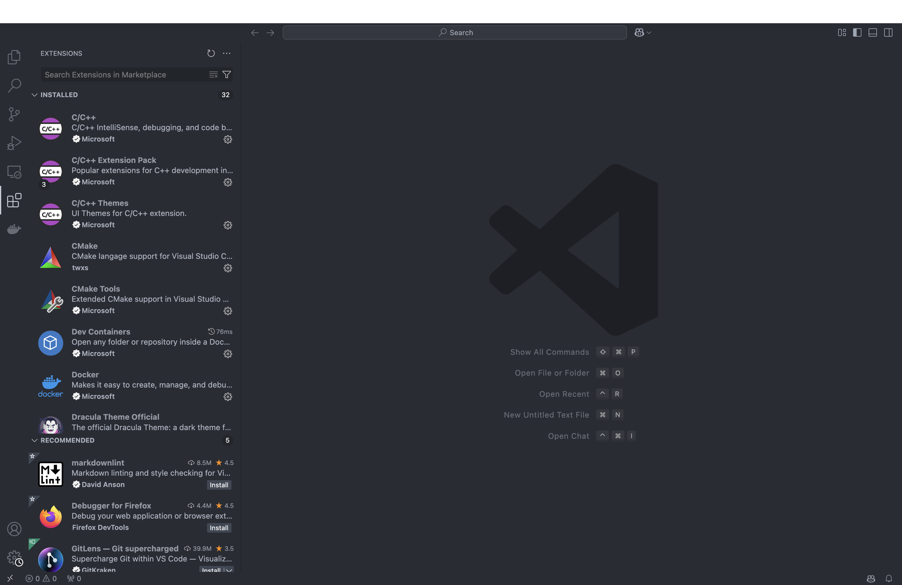

    2. En este pestaña deberemos **introducir en la buscador de extensiones, ubicado en la parte superior de la pestaña, lo siguiente *Dev Container***, como se puede apreciar en la siguiente imagen: 
        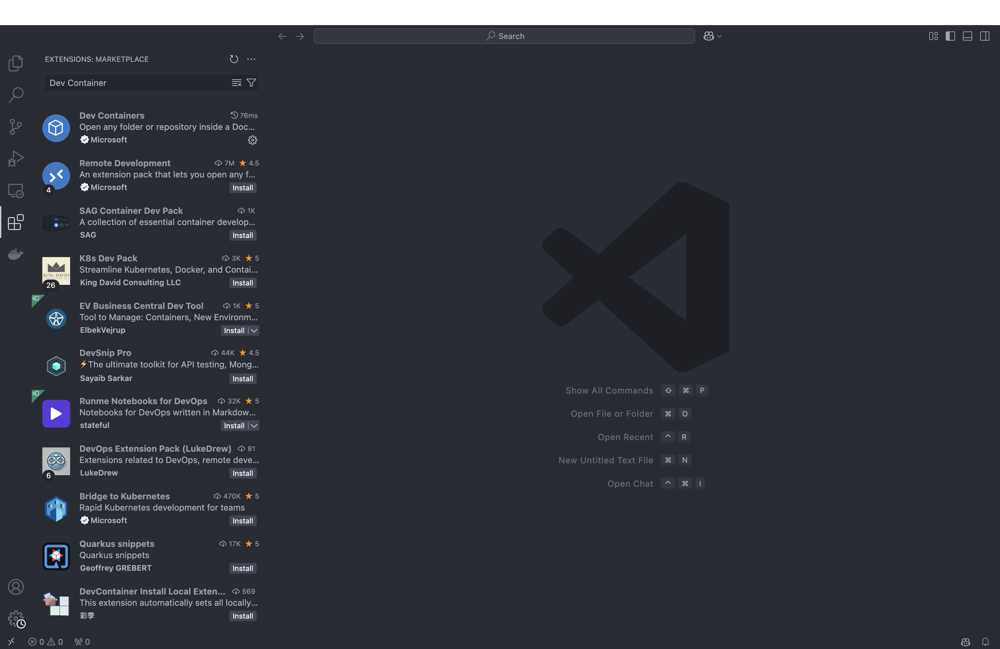
    
    3. **Pulsar sobre la opción llamada *Dev Container*** creada por *Microsoft* que debe tener la siguiente apariencia: 
        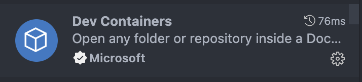

    Redigiendos a la siguiente pestaña en *Visual Studio Code*: 
        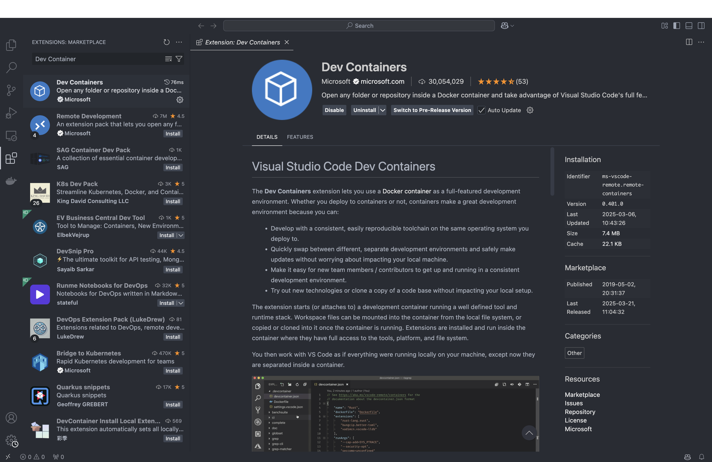

    4. En esta página **pulsar sobre el botón *Install* que se encuentra ubicado debajo del nombre de la extensión**, como se puede observar en la siguiente imagen: 
        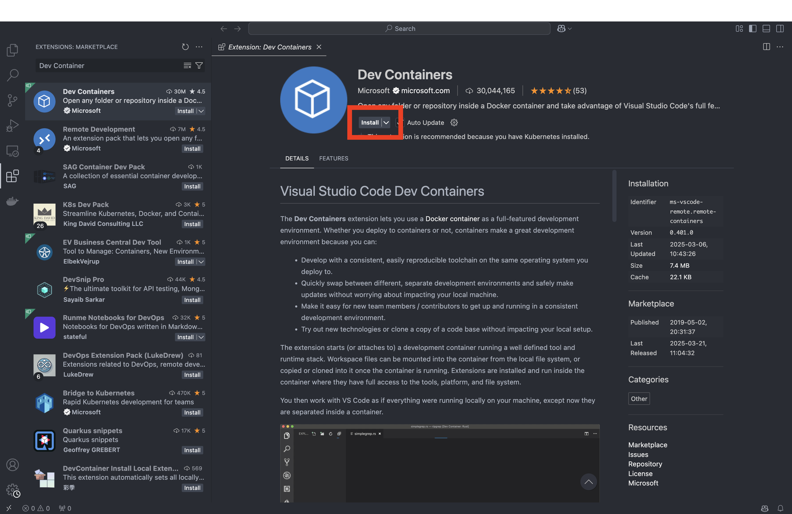

    Tras completar estos pasos, la extensión de *Visual Studio Code* *Dev Containers* estará instalada. Para **comprobar que la instalación se ha realizado de forma corecta** debermeos realizar los **siguientes pasos**:
    1. **Pulsar en las flechas ubicados en la parte inferior de la ventana** de *Visual Studio Code*, como se observa en la siguiente imagen: 
        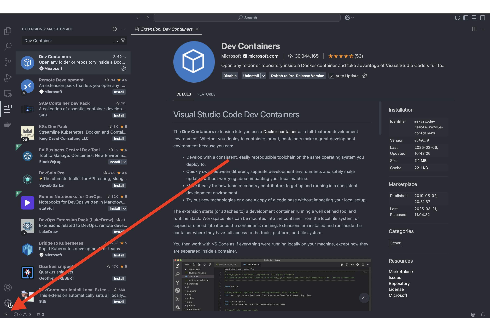

    2. **En la parte susperior de la pantalla donde se ubica en buscador de *Visual Studio Code*** deberemos encontrar las opciones resaltadas en la siguiente imagen: 
        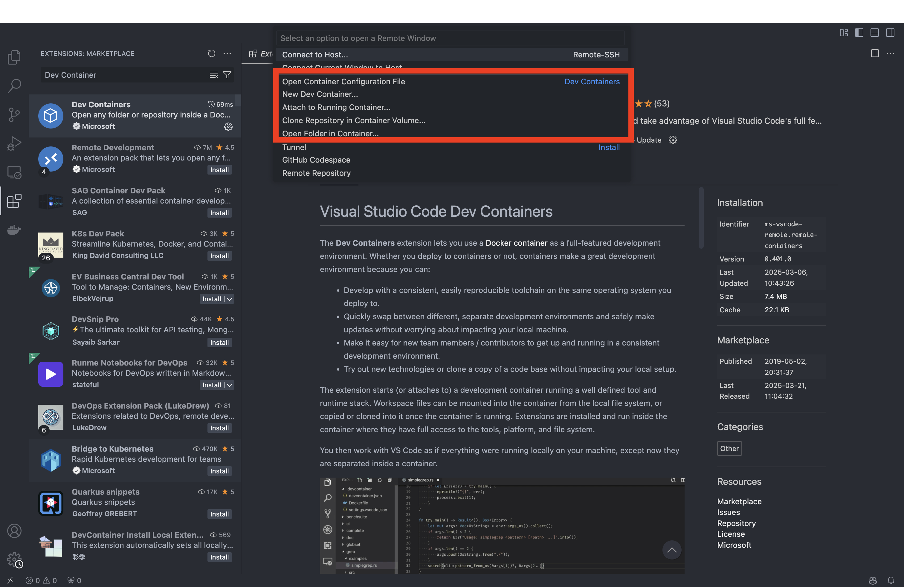

## Ejecución Del Entorno de Simulación QoQo Quantum Cryptography Docker

Una vez instaladas todas las dependecias destacadas en el punto anterior [Dependencias del Entorno de Simulación QoQo Quantum Cryptography Docker](#dependencias-del-entorno-de-simulación-qoqo-quantum-cryptography-docker) podremos ejecutar el Entorno de Simulación, realizando los siguientes pasos:

1. En primer lugar, deberemos **especificar la ruta donde se encuentra nuestro el proyecto *QoQo Quantum Cryptography Docker***, para poder enlazar el contendor *docker* con la carpeta `volumen_archivos_docker`, consiguiendo que todos los archivos queden guardados en dicha carpeta. La especificación del *path* dependera del sistema operativo en el que vayamos a ejecutar el contenedor *docker*:
    - ***Windows*** para especificar el *path* deberemos cambiar ciertas variables de los archivos del proyecto, para realizar esto seguir los siguientes pasos:
        1. Abrir el Explorador de Archivos de *Windows*.
        2. Navega hasta la carpeta del proyecto.
        3. Pulsa sobre la barra de direcciones (donde aparece el nombre de la carpeta).
        4. Verás el *path* completo, como por ejemplo: `C:\Users\TuUsuario\Documents\MiCarpeta`.
        5. Copiar dicho *path* pulsado *Ctrl + C*.
        6. Sustituir en el archivo [/.devcontainer/docker-compose.yml](./.devcontainer/docker-compose.yml) el volumen definido en la parte *Volumes* por `- C:/Users/TuUsuario/Documents/MiCarpeta/volumen_archivos_docker/:/volumen_archivos_docker/` **destacar que las barras \ tiene que cambiadas por barras / que son las soportados por *Docker***. A continuación, una imagen de como quedaría el archivo [/.devcontainer/docker-compose.yml](./.devcontainer/docker-compose.yml): 
            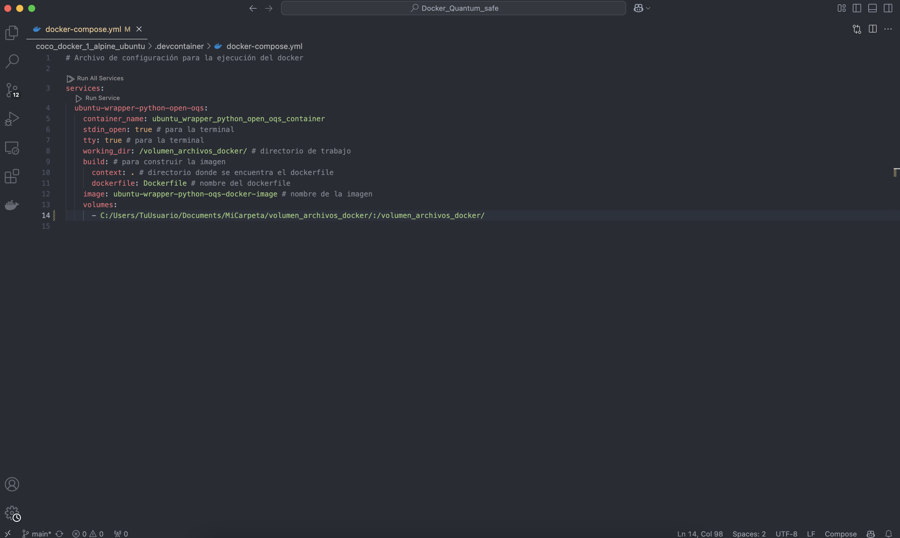

        7. Guardar los cambios realizados en el archivo [/.devcontainer/docker-compose.yml](./.devcontainer/docker-compose.yml).
        8. Sustituir en el archivo [/.devcontainer/devcontainer.json](./.devcontainer/devcontainer.json) el *mount* definido en la parte *mounts* por `"source=${localEnv:USERPROFILE}/volumen_archivos_docker,target=/volumen_archivos_docker,type=bind"`. A continuación, una imagen de como quedaría el archivo [/.devcontainer/devcontainer.json](./.devcontainer/devcontainer.json): 
            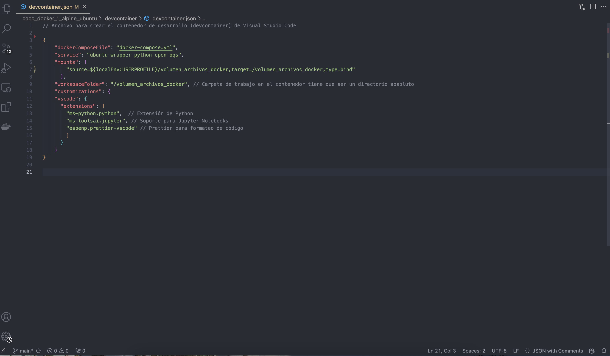

        9. Guardar los cambios realizados en el archivo [/.devcontainer/devcontainer.json](./.devcontainer/devcontainer.json).

    - ***Mac y Linux*** el proyecto se puede ejecutar sin problema, puesto que, *Docker* deducirá los *paths*.
2. **Inciar *Docker Desktop*** para ejecutar el *daemon* de *Docker* y poder desplegar *dockers*.
3. **Abrir la carpeta del proyecto *QoQo Quantum Cryptography Docker* en *Visual Studio Code***.
4. Para **abrir el *Dev Container*** dispondremos de **dos formas**:
    - **Al abrir la carpeta del proyecto *QoQo Quantum Cryptography Docker* en *Visual Studio Code* en la parte inferior derecha aparecerá un recuadro señalando que si se puslsa sobre *Reopen in Container* se ejecutará el contenedor *Docker*** y abrirá en *Visual Studio Code* una ventana que estará enlazada con el *docker* y su volumen, donde ya se podrá crear archivos y ejecutarlos. A continuación, una imagen de la localización del recuadro: 
        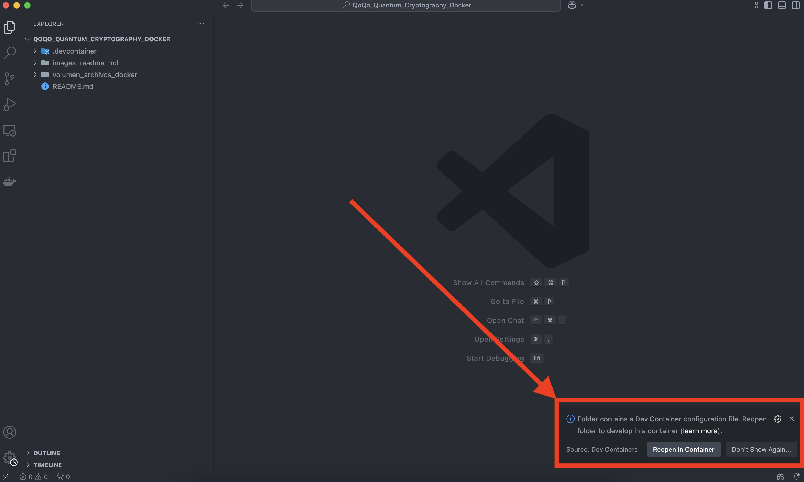

    - **O realizando los siguientes pasos**:
        1. **Pulsar en la flechas ubicadas en la parte inferior izquierda**, como se puede observar en la siguien imagen: 
        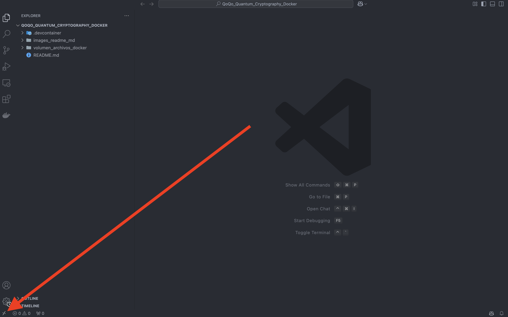

        2. Se abrirá un menu de conexiones donde **pulsando sobre *Reopen in Container*** se ejecutará el contendor de igual manera que se explico en la primera forma. A continuación, una imagen del menú de conexiones con la opción marcada por una flecha: 
        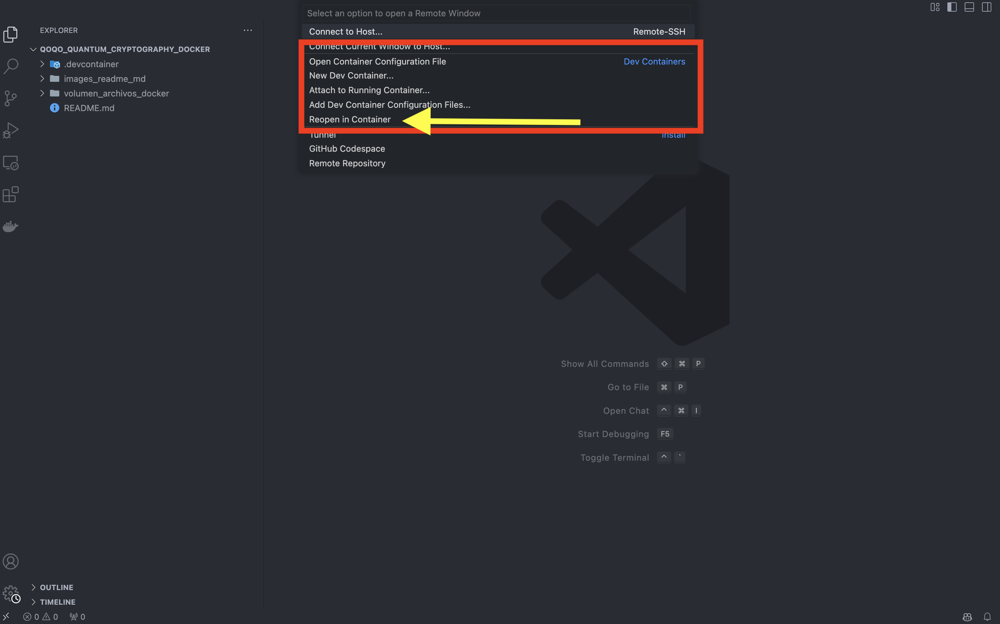

5. **Tras esto se nos abrirá una nueva ventana de *Visual Studio Code* que estará enlazada con el *docker* *QoQo Quantum Cryptography Docker***. A continuación, la pantalla que se abrirá al ejecutar el contenedor: 
    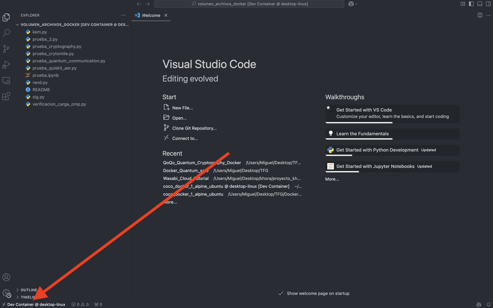

6. Para **comprobar que nos encontramos en el *Docker*** podremos** visualizar en la parte inferior** izquierda (donde se ubican las flechas destacadas anteriormente) de la nueva pantalla de *Visual Studio Code* algo así **`Dev Container @ desktop-linux`**, esto significa que estamos en el *Docker*.

## Como salir del Entorno de Simulación QoQo Quantum Cryptography Docker

Para **salir del entorno de simulación** deberemos realizar los siguientes pasos:
1. **Pulsar sobre las flechas ubicadas en la parte inferior izquierda de la ventana**, donde pondrá algo como `Dev Container @ desktop-linux`. A continuación, una imagen de su ubucación: 
    

2. **Se abrirá un menú de conexiones donde pulsando sobre *Close Remote Connection***, *Visual Studio Code* saldrá del *docker* además de que cierrará el mismo. A continuación, una imagen del a ubiación de la opción de salida del dev container: 
    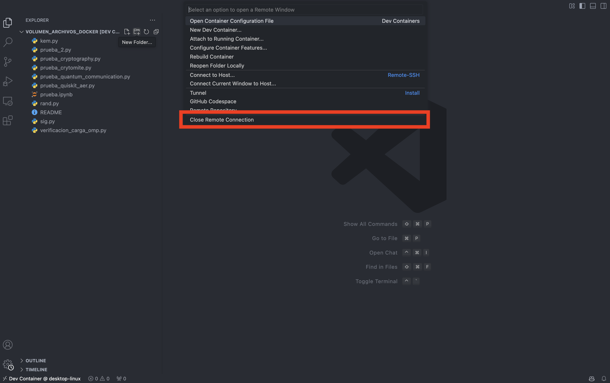

## Como Reconstruir el Entorno de Simulación QoQo Quantum Cryptography Docker 

En caso de que se **quiera reconstruir el entorno de simulación de nuevo**, ya sea porque hemos instalado varias librerías que no necesitemos o porque hayamos roto de alguna manera alguna librería de *Python*, deberemos relalizar los siguiente pasos:
1. **Pulsar sobre las flechas ubicadas en la parte inferior izquierda de la ventana**, donde pondrá algo como `Dev Container @ desktop-linux`. A continuación, una imagen de su ubucación: 
    

2. **Se abrirá un menu de conexiones donde pulsando sobre *Rebuild Container***, *Visual Studio Code* nos reiniciará la ventana. A continuación, una imagen del a ubiación de la opción de salida del dev container: 
    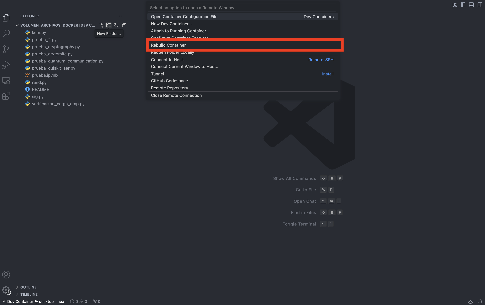

## Comandos Utiles de Docker Cli (Command Line Interface)

En este apartado es una lista de aquellos **comandos utiles de *Docker Cli***:
- Listar los *dockers* activos --> `docker ps`
- Lista todos los *dockers* (activos y no activos) --> `docker ps -a`
- Parar un docker activo --> `docker stop <id_o_nombre_del_docker>`
- Borrar un docker --> `docker rm <id_o_nombre_del_docker>`
- Listar imagenes de *docker* --> `docker image ls`
- Borrar imagen de *docker* --> `docker rmi <id_o_nombre_de_la_imagen_de_docker>`
- Para visualizar el espacio ocupado por imágenes, volúmenes y contenedores en Docker, además podremos observar cuanto de ese espacio no esta es utilizado por *dockers* activos y se puede borrar --> `docker system df`
- Eliminar toda la cache del *builder* de *docker* --> `docker builder prune`

**Cabe destacar que todas estas acciones también se pueden realizar desde la aplicación de *Docker Desktop***.

## Posibles Errores en el Sistema Operativo Windows

Si en el **sistema operativo *Windows* al ejecutar el *Docker* tiene lugar un error de *Mount denied* o *permission denied***, deberemos realizar los **siguientes pasos para solucionarlo**:

1. Abrir la aplicación de *Docker Desktop*.
2. Pulsar en el icono del engranaje, ubicado en la parte superior derecha, que nos llevará a *Settings*.
3. En el menú lateral, pulse en: *Resources* --> *File sharing*.
4. En esta página, si bajamos hasta el final de esta, podremos ver una lista de carpetas o discos permitidos para compartir con contenedores Docker.
5. Verificá que el disco o carpetas donde se ubique el proyecto esté en esa lista. Por ejemplo, si tu proyecto está en `D:\proyectos\docker`, el disco `D:` debe estar compartido. Si solo aparece `C:` pero tu código está en otro disco, seleccione el disco o la carpeta manualmente y pulse sobre el simbolo *+* para añadir el *path* selecionado a la lista.
6. Pulse sobre *Apply & Restart* para aplicar los cambios realizados.

### Licencia

Este proyecto está licenciado bajo la Licencia Pública General GNU v3.0 - consulta el archivo [LICENSE](./LICENSE) para más detalles.

### Créditos 

Diseñado y Creado por Miguel Salas Heras [LinkedIn](https://www.linkedin.com/in/miguelsalasheras/), como parte del Trabajo de Fin de Grado *Diseño y desarrollo de entorno de simulación de protocolos criptográficos pre-cuánticos, cuánticos y post-cuánticos*

Tutora del Trabajo de Fin de Grado Ana Isabel Gonzalez-Tablas Ferreres [LinkedIn](https://www.linkedin.com/in/ana-isabel-gonzalez-tablas-ferreres-31b5331/)
